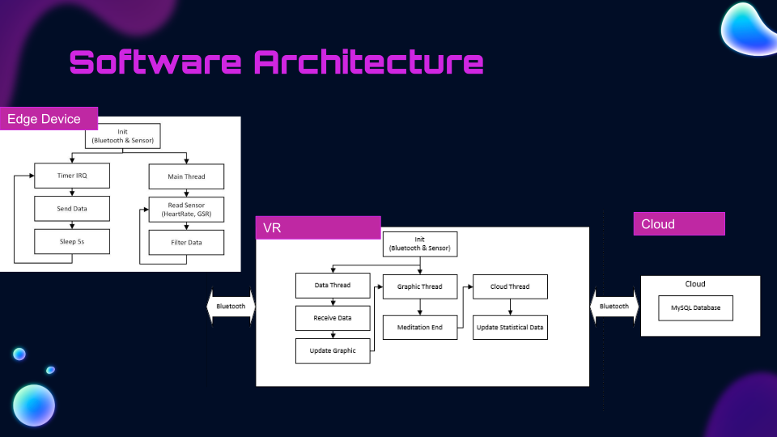

# Om-VR: A VR meditation app enabled by wearable device.

 
 
 
 

## Teamwork

Yue Sun: Hardware & Software Dev. & VR Dev.

Yuqi Huang: Product Manager & VR Dev.

Ke Wang: VR Dev.

Angela Jin: Designer

Date: 10/27/2018